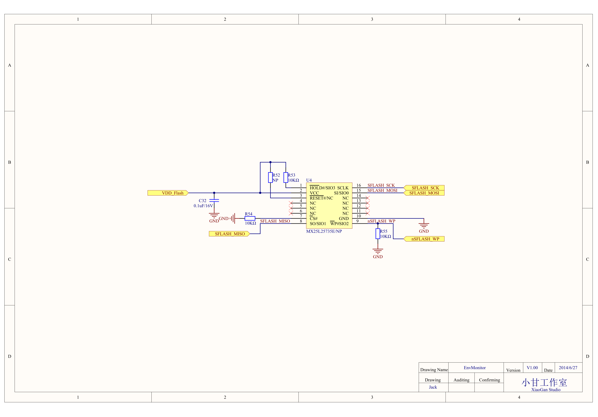

#EnvMonitor MainBoard原理图第一次Review
**时间:** 2014年6月27日

**参加人员：** 不限，有兴趣者都可编辑此文件，参与探讨

##1.EnvMonitor MainBoard图纸

- 原理图PDF版本：[6月27日原理图](https://github.com/xiaogan-Studio/OpenCloudEnvMonitor/blob/master/Doc/hardware/%E5%8E%9F%E7%90%86%E5%9B%BE/EnvMonitor%202014-6-27.pdf)
- 关于原理图的设计，请参考[here](https://github.com/xiaogan-Studio/OpenCloudEnvMonitor/blob/master/Doc/design/EnvMonitor%E5%8E%9F%E7%90%86%E5%9B%BE%E5%88%86%E6%9E%90.docx)

## 2.相关问题探讨
### 2.1 按键升级
添加一个按键，用来指示是否进入升级模式。即，在Bootloader启动过程中，判断该按键的状态，从而判断是否进入升级模式。

### 2.2 消减一路I2C
目前单总线芯片DS2482独占一路I2C（P0.19 P0.20）。浪费资源，并且系统只有两路硬件I2C，考虑从下面两路I2C中去除一路：
- P0.07 P0.08
- P0.09 P0.10
然后将P0.19 P0.20这一路I2C同时导出给外设(SensorBoard)使用。

### 2.3 电源启动方式修改
将`VDD_Li_EN`信号上拉到`VCC_3V3`，之所以这样做，原因如下：

目前的启动方法是，长按S2开关，等系统启动后，立马去拉高`VDD__Li__EN`，这时才可以松开S2。在nRF1822置高`VDD_Li_EN`之前，不能松开S2，但是这个时机比较难掌控
恐用户使用起来不方便。
不如在原来基础上增添`VDD_Li_EN`的上拉电阻，但是只能从`VDD_3V3`上拉，而不是`VDD_Li`上拉，否则会造成系统无法断电。
