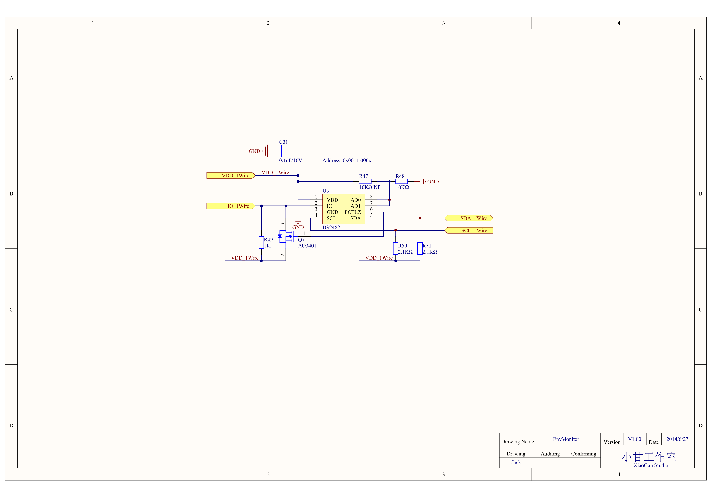

#EnvMonitor MainBoard原理图第一次Review
**时间:** 2014年6月27日

**参加人员：** 不限，有兴趣者都可编辑此文件，参与探讨

##1.EnvMonitor MainBoard图纸
- 原理图PDF版本：[6月27日原理图](https://github.com/xiaogan-Studio/OpenCloudEnvMonitor/blob/master/Doc/hardware/%E5%8E%9F%E7%90%86%E5%9B%BE/EnvMonitor%202014-6-27.pdf)
- 关于原理图的设计，请参考[here](https://github.com/xiaogan-Studio/OpenCloudEnvMonitor/blob/master/Doc/design/EnvMonitor%E5%8E%9F%E7%90%86%E5%9B%BE%E5%88%86%E6%9E%90.docx)

## 2.相关问题探讨
### 2.1 按键升级
添加一个按键，用来指示是否进入升级模式。即，在Bootloader启动过程中，判断该按键的状态，从而判断是否进入升级模式。

### 2.2 消减一路I2C
目前单总线芯片DS2482独占一路I2C（P0.19 P0.20）。浪费资源，并且系统只有两路硬件I2C，考虑从下面两路I2C中去除一路：
- P0.07 P0.08
- P0.09 P0.10
然后将P0.19 P0.20这一路I2C同时导出给外设(SensorBoard)使用。

### 2.3 电源启动方式修改
将`VDD_Li_EN`信号上拉到`VCC_3V3`，之所以这样做，原因如下：

目前的启动方法是，长按S2开关，等系统启动后，立马去拉高`VDD__Li__EN`，这时才可以松开S2。在nRF1822置高`VDD_Li_EN`之前，不能松开S2，但是这个时机比较难掌控
恐用户使用起来不方便。
不如在原来基础上增添`VDD_Li_EN`的上拉电阻，但是只能从`VDD_3V3`上拉，而不是`VDD_Li`上拉，否则会造成系统无法断电。

**强制断电，需要如何操作？**

### 2.4 USB访问SPI Flash功能
想法是这样的：当插入USB后，不仅可以对锂电池充电，而且可以更新固件，读取存储在Flash中的环境数据。

但是由于nRF51822不支持USB，只能外扩芯片来解决。目前想到的方法有如下两种：
- [ ] 通过USB转SPI芯片，上位机直接访问SPI Flash。
      - 优点 ：简单，nRF51822不需要增加太多的代码
      - 缺点 ：USB连接时，无法进行数据采集工作。因为SPI Flash由USB上位机控制，nRF51822无法访问，此时只能采集一次数据就上传给蓝牙主机。
- [x] nRF51822外扩一个SPI转USB的芯片，从而增加USB功能。上位机通过USB与nRF51822通信，然后再由nRF51822将SPI Flash的数据传输给上位机
     - 优点： SPI Flash由nRF1822控制，所以USB连接时，可以同时进行数据采集。交互性更好，可以实现更多其他的功能。
     - 缺点： 增加代码空间较大，调试复杂 

待探讨确认问题：
- [x] 方案选择: 使用第二种方案，nRF51822外扩SPI转USB芯片，与上位机通信。
- [ ] 确保USB上位机及nRF51822不同时访问SPI Flash。
    - 方法1： 通过某种方式让nRF51822知道USB的连接状态，当USB连接后，自动禁止本身对SPI Flash的访问
    - 方法2： 上位机与nRF51822通信，相互协商，确保不同时访问SPI Flash。通信方式可以选择SPI，nRF51822支持SPI从机功能。
- [ ] 芯片选型，目前找到如下两款芯片：
   -  [Silicon Labs CP2130](http://www.silabs.com/products/interface/usbtouart/pages/usb-to-spi-bridge.aspx)
   -  [SPI转USB](http://www.maximintegrated.com/cn/products/interface/controllers-expanders/MAX3421E.html) 芯片太贵  

更详细的讨论，请参考[硬件设计文档](https://github.com/xiaogan-Studio/OpenCloudEnvMonitor/blob/master/Doc/design/nRF51822%E7%A1%AC%E4%BB%B6%E8%AE%BE%E8%AE%A1%E7%9B%B8%E5%85%B3%E5%88%86%E6%9E%90.xlsx)
中“增加USB功能的探讨”一页。

### 2.5 充电时间的考虑
目前USB充电电流为1000/R57= 1000/3000 约为333mA。是否考虑增大充电电流，从而减少充电时间。

### 2.6 SPI Flash Reset时序
就原理图上看，MX25L25735E芯片的RESET引脚是上拉VDD_Flash的。会不会影响芯片上电时序？

### 2.7 S1防抖
S1复位开关，需要接防抖电路吗？

### 2.8 SPI Flash 容量
目前为256Mb，32MB，感觉有点小。在价格合适的情况下，考虑增大容量。

容量粗略计算：

每秒10次采样，最多10个设备，那么按照每秒1KB的数据量(平均每个设备10字节/次的数据量)，则一天的数据量为：`1KB*60*60*24=86400KB` 约85MB。

再考虑到固件及其他的数据，使用128MB是最小的容量。
