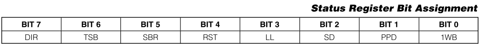

# DataSheet学习
## 1.简介
## 2.状态寄存器

DS2482用只读状态寄存器来向上位机报告1-Wire总线状态。所有1-Wire总线命令和DS2482复位命令，会将读指针放置到状态寄存器的位置，从而减少
协议开销。
状态寄存器只在执行某些特定的命令时才会被更新。
详情描述如下：
### 2.1.1 1-Wire Busy(1WB)
1-Wire总线忙标志位，1表示总线上有数据通信，0表示总线空闲。有关何时1WB状态变更，以及持续时间请参考[Function Commands一节](##Function Commands)。

### 2.1.2 Presence-Pulse Detect (PPD)
每次1-Wire复位命令会更新PPD位。在presence-detect阶段，如果DS2482在tMSP时间内检测到从机发送过来的在线脉冲，则PPD被置为1。

### 2.1.3 Short Detected（SD）
SD位在每次执行1-Wire复位操作时被更新。在presence-detect阶段，如果DS2482在tSI时间内检测总线为0，则SD被置为1。如果SD为1，则PPD为0。

### 2.1.4 Logic Level（LL）
LL位表示1-Wire总线的逻辑状态，而不需要初始化任何1-Wire通信。LL位在每次读取状态寄存器的时候被更新。

### 2.1.5 Device Reset（RST）
如果RST为1，则表明DS2482执行过内部复位流程，无论是上电复位或者是因为响应设备复位命令(Device Reset Command)引起的。当DS2482执行Write Configuration
命令后，RST被置为0。

### 2.1.6 Single Bit Result（SBR）
- 在1-Wire Single Bit命令时，SBR表示命令的结果；
- 在1-Wire Triplet命令时，SBR表示返回结果的第一位，第二位由TSB表示。 

### 2.1.7 Triplet Second Bit（TSB）
1-Wire Triplet命令的返回结果的第二位。只在Triplet命令时被更新，在其他情况下无意义。

### 2.1.8 Branch Direction Taken（DIR）
在1-Wire Triplet命令执行时，DIR表示在搜索时选择的方向。只在Triplet命令时被更新，在其他情况下无意义。

## Function Commands