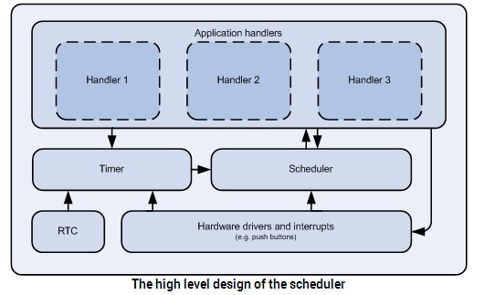

# Scheduler handling library
  调度器的作用是将执行流程从中断上下文(Interrupt context)切换到Main上下文(Main context).

## 必要条件：
   - Main上下文：
     - 为所需要的所有事件定义一个处理函数(handler);
     - 在进入主循环之前，调用APP_SCHED_INIT()函数初始化调度器;
     - 在主循环中调用app_sched_execute()，当系统从任何一个等待事件中唤醒后（典型情况是`sd_app_evt_wait()`函数返回）。
  - Interrupt上下文：
    - 在中断处理函数中，调用`app_sched_event_put()`函数，将事件插入到调度器的队列中。`app_sched_execute()`函数将会从队列中取出该事件，并且
    调用该事件的处理函数。    
    
    

    
