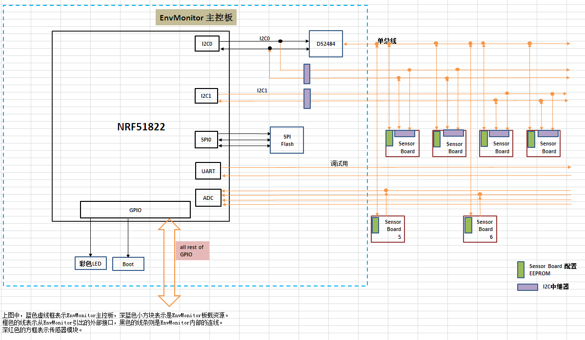

OpenCloudEnvMonitor
===================

**开源个人环境监测平台**

##系统简介
  系统框图请参考[这里](https://github.com/xiaogan-Studio/OpenCloudEnvMonitor/blob/master/Doc/design/%E7%B3%BB%E7%BB%9F%E6%A1%86%E5%9B%BE.xlsx)
  (Tips：点击 View Raw 下载excel文件查看。或者感兴趣的话，可以clone下来整个项目再查看。各种资料请到Doc目录下查看.)
  
         
  
  
  
  

## 相关资源列表
### 硬件设计资源
[envMonitor MainBoard工程目录](./Doc/hardware/原理图),包含PDF版本的原理图以及AD工程文件
[envMonitor MainBoard原理图设计分析](./Doc/design/EnvMonitor原理图分析.docx)，简单分析，等硬件稳定后会提供详细分析文档。

### 软件设计资源