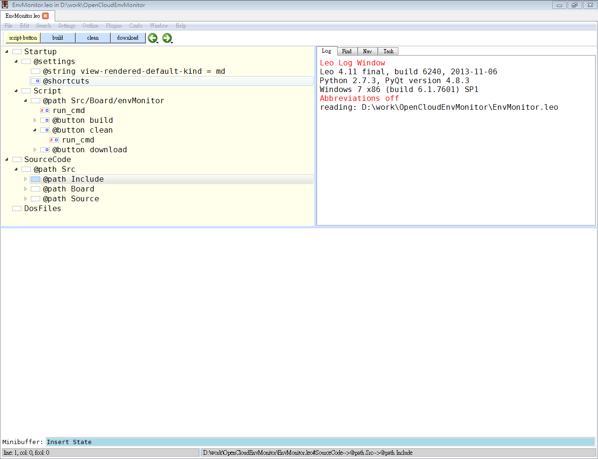

**目录**
- [开发环境](#建立开发环境)
- [编译](#编译)
- [下载](#下载)

-----------------------

#建立开发环境

EnvMonitor支持三种开发环境，这三种环境都支持Windows和Linux系统。

- Leo Editor开发环境

- Eclipse开发环境

- 命令行开发环境
  
##0. 交叉工具链
###0.1 Windows
Windows版本的交叉工具链，已经放在仓库中，不需要下载及安装。

###0.2 Linux
- [ ] TODO:添加Linux下交叉工具链的安装方法。

##1. Leo Editor

Leo编辑器是一款大纲编辑器，基于Python和QT开发。其最大的特点是文学编程和强大的扩展性。Leo官网是这样描述其自身的：
 
“Leo是一个可以帮组程序员、作家、网页设计者等人员加速其工作流程及工作效率的PIM工具、IDE、大纲编辑器。Leo独一无二的功能让你以革命性的新方式管理你的数据。”

[Leo官网链接地址](www.leoeditor.com),其中包含有Leo编辑器的教程。

由于Leo是基于Python和QT，要建立Leo开发环境，需要安装如下软件：

- python

- PyQt

- Leo Editor 

### 1.1 Windows
#### 1.1.1 安装Python

到[Python官网](https://www.python.org/downloads/)下载Windows版本安装软件。根据自己的喜好，下载Python3或者Python2，然后安装提示安装Python。

#### 1.1.2 安装PyQt
到[官网](http://www.riverbankcomputing.co.uk/software/pyqt/download)下载PyQt二进制安装包，并安装提示安装。注意需下载与你安装的Python版本相对应的PyQt安装包。

Tips：可以到[这里](http://www.mirrorservice.org/sites/pythonxy.com/)下载安装Python(x,y),该软件包含了Python，PyQt，iPython，numpy等一系列Python相关的常用工具。这是比较简单的安装方法。

#### 1.1.3 Leo Editor
到[官网](http://www.leoeditor.com/download.html)下载Leo。建议到[SourceForge](http://sourceforge.net/projects/leo/files/)上下载[Leo Windows安装包](http://sourceforge.net/projects/leo/files/Leo/4.11-final/LeoSetup-4.11-final.exe/download)

### 1.2 Linux
#### 1.2.1 Python

Linux常用发行版本中一般都会默认安装Python。

#### 1.2.2 PyQt

- Ubuntu：`sudo apt-get install python-qt4`

- gentoo: `emerge -av pyqt`

- fedora: `yum install python-qt`

#### 1.2.3 Leo

1. 到[这里](http://sourceforge.net/projects/leo/files/Leo/)下载Leo最新的稳定版,下载zip压缩包。
2. 解压缩到任何目录,uzip /path/to/leo-4.11-final.zip. 例如：将leo-4.11-final.zip下载到了~/download,则用如下命令解压：

    `cd ~/download`
   
    `unzip leo-4.11-final.zip`
3. 进入上一步解压缩的目录中，例如 `cd leo-4.11-final`，然后执行`sudo python setup.py install` 安装Leo。

##2. Eclipse
Eclipse的安装方法网络上已有很多，就不在此赘述了。但注意请安装Eclipse for C/C++版本。

##3. 命令行

- [ ] 添加Windows和Linux下使用的编译脚本

# 编译

# 下载
